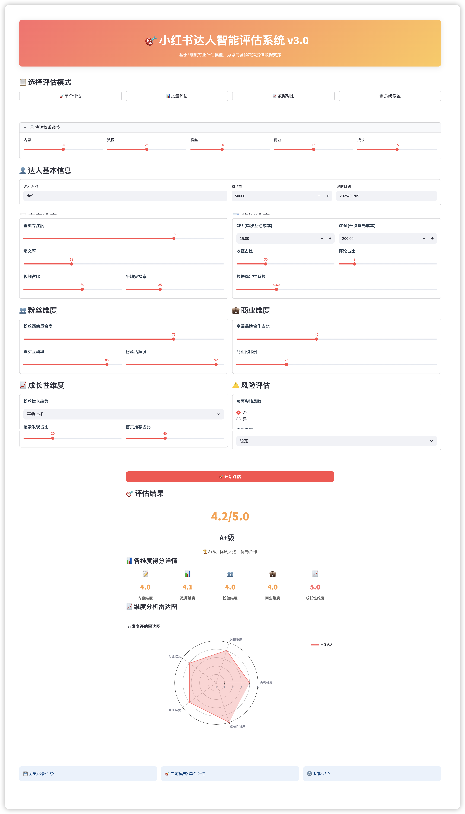

# 小红书达人智能评估系统

> 基于行业标准的专业KOL评估工具 - 现代化界面设计

## 🌟 系统概述

小红书达人智能评估系统是一款专为品牌方和MCN机构设计的KOL评估工具，基于行业权威标准，提供科学、准确的达人价值评估。v3.0版本采用现代化卡片式界面设计，提供更优秀的用户体验。


## 📁 项目结构

```
小红书达人评估系统/
├── evaluator.py           # 基础版评估系统
├── advanced_evaluator.py  # 专业版评估系统
├── modern_evaluator.py    # 现代化界面版本（推荐）
├── requirements.txt       # 项目依赖
├── 示例数据模板.csv       # 批量评估数据模板
├── 使用指南.md            # 详细使用说明
├── README.md              # 项目说明文档
├── .github/workflows/     # GitHub Actions自动构建
└── venv/                  # Python虚拟环境
```

## 🚀 系统版本

### 🎯 **v1.0 基础版本** (`evaluator.py`)
- **适用场景**: 快速评估、简单筛选
- **核心功能**: 基础四维度评估（影响力、内容质量、互动表现、商业契合度）
- **使用方式**: `streamlit run evaluator.py`

### 🚀 **v2.0 专业版本** (`advanced_evaluator.py`)
- **适用场景**: 专业筛选、批量处理、深度分析
- **核心功能**: 五维度专业评估体系 + 批量处理 + 数据分析
- **使用方式**: `streamlit run advanced_evaluator.py`

### 💎 **v3.0 现代化版本** (`modern_evaluator.py`) - **🔥 推荐使用**
- **适用场景**: 专业评估 + 现代化体验 + 全功能集成
- **核心功能**: 
  - 🎨 现代化卡片式界面设计
  - 🎯 五维度专业评估体系
  - 📊 批量处理与数据对比
  - ⚖️ 灵活权重配置
  - 📈 可视化分析图表
  - ⚠️ 无控件标签警告（完全优化）
- **使用方式**: `streamlit run modern_evaluator.py`

## 🛠️ 快速开始

### 1. 环境准备
```bash
# 激活虚拟环境
source venv/bin/activate  # macOS/Linux
# 或 venv\Scripts\activate  # Windows

# 安装依赖
pip install -r requirements.txt
```

### 2. 启动系统
```bash
# 启动现代化版本（v3.0 推荐）
streamlit run modern_evaluator.py

# 或启动专业版（v2.0）
streamlit run advanced_evaluator.py

# 或启动基础版（v1.0）
streamlit run evaluator.py
```

### 3. Windows可执行文件
通过GitHub Actions自动构建的Windows可执行文件：
- **modern版本**: `redbook-modern-v3.0.exe` - 现代化界面版本
- **legacy版本**: `redbook2.0.exe` - 传统界面版本

### 4. 使用说明
- 打开浏览器访问显示的本地地址（通常是 http://localhost:8501）
- 详细使用说明请参考 `使用指南.md`

## 📊 评估体系

### v3.0 现代化版评估维度
1. **内容维度** (25%) - 垂类专注度、爆文率、视频完播率
2. **数据维度** (25%) - CPE、CPM、互动健康度、数据稳定性
3. **粉丝维度** (20%) - 画像匹配度、真实互动率、活跃度
4. **商业维度** (15%) - 品牌层级、商业化平衡
5. **成长性维度** (15%) - 增长趋势、流量来源质量

### v3.0 现代化特性
- 🎨 **卡片式界面设计** - 美观直观的现代化布局
- 🎯 **智能标签管理** - 无Streamlit警告，完全优化体验
- ⚖️ **动态权重调整** - 实时权重配置和预览
- 📈 **可视化分析** - 雷达图、散点图、分布图
- 🔄 **多模式切换** - 单个评估、批量处理、数据对比、系统设置
- 📱 **响应式设计** - 适配不同屏幕尺寸

## 🔧 技术特性

### GitHub Actions自动构建
- **触发条件**: 推送到main分支或手动触发
- **构建产物**: Windows可执行文件
- **支持版本**: modern v3.0 + legacy v2.0
- **缓存优化**: pip依赖缓存，提升构建速度

## 📝 批量评估

使用 `示例数据模板.csv` 文件进行批量评估：
1. 下载模板文件
2. 填入达人数据
3. 在系统中上传文件
4. 获得批量评估结果

## 📋 版本对比

| 功能特性 | v1.0 基础版 | v2.0 专业版 | v3.0 现代化版 |
|---------|------------|------------|---------------|
| 评估维度 | 4维度 | 5维度 | 5维度（增强） |
| 界面设计 | 基础界面 | 标准界面 | 🎨 现代化卡片式 |
| 批量处理 | ❌ | ✅ | ✅ |
| 数据对比 | ❌ | ✅ | ✅ 增强版 |
| 权重配置 | ❌ | ✅ | ✅ 动态调整 |
| 可视化图表 | 基础 | 标准 | 🎯 增强版 |
| 系统警告 | 有警告 | 有警告 | ⚠️ 零警告 |
| 响应式设计 | ❌ | ❌ | ✅ |
| 推荐使用场景 | 快速试用 | 专业评估 | 🔥 专业+现代化 |

## 🎯 推荐使用

- **新用户推荐**: 直接使用 `modern_evaluator.py` (v3.0)
- **专业机构**: `modern_evaluator.py` (v3.0) 或 `advanced_evaluator.py` (v2.0)
- **快速试用**: `evaluator.py` (v1.0)

## 🔗 相关链接

- [使用指南](使用指南.md) - 详细操作说明
- [GitHub Actions配置](GitHub-Actions配置说明.md) - 自动构建说明
- [示例数据模板](示例数据模板.csv) - 批量评估模板
